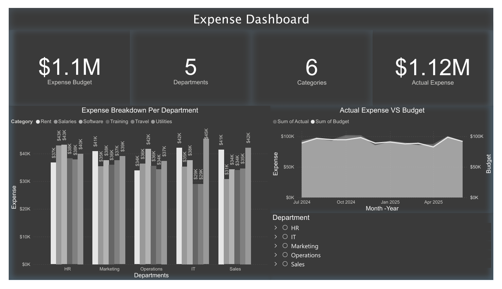

# Expense Dashboard

This folder contains the Expense Dashboard project. It includes the following files:

- `Raw_Data.csv`: The source data for the dashboard, containing monthly expense details by department and category.

## How to use

1. Open the Power BI Desktop and load the dashboard file (if available).
2. Use `Raw_Data.csv` as the data source for the dashboard.
3. Refresh the data to ensure the latest updates are reflected.

## Notes

- Ensure the CSV file is not modified externally to maintain data integrity.
- Back up the dashboard file before making significant changes.
