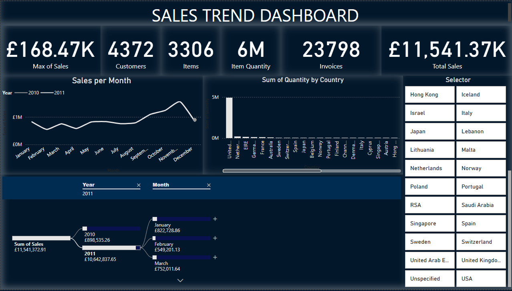

# Sales Dashboard

This folder contains the Sales Dashboard project. It includes the following files:

- `sales_dashboard.pbip`: The Power BI project file for the Sales Dashboard.
- `sales_dashboard.pbix`: An alternative Power BI file format for the dashboard.
- `Raw_Data.xlsx`: Source data for the dashboard in Excel format.
- `dashboard.png`: A screenshot or image representation of the dashboard.

## How to use

1. Open the `sales_dashboard.pbip` or `sales_dashboard.pbix` file in Power BI Desktop.
2. Ensure `Raw_Data.xlsx` is available in the same folder for data refresh.
3. Refresh the data to ensure the latest updates are reflected.

## Notes

- Keep the Excel file updated with the latest sales data.
- Back up the dashboard files before making significant changes.
